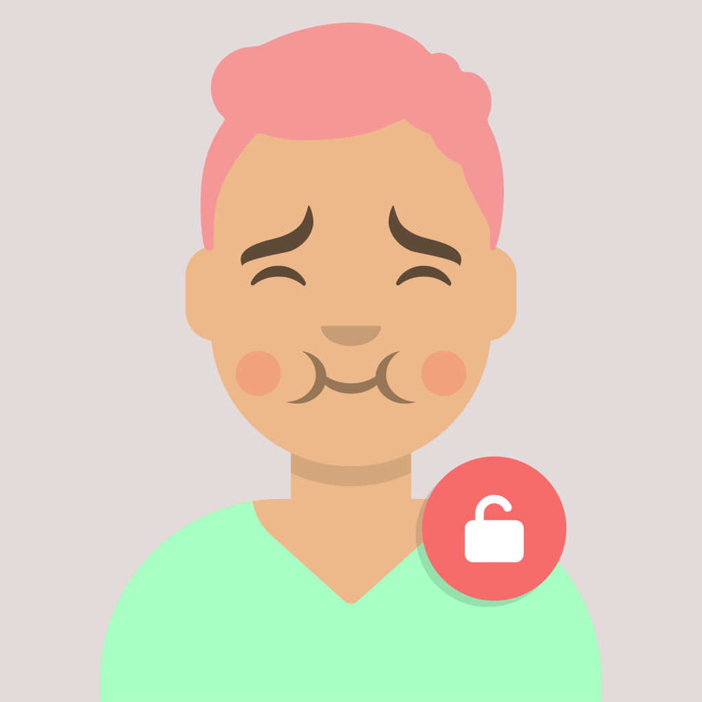
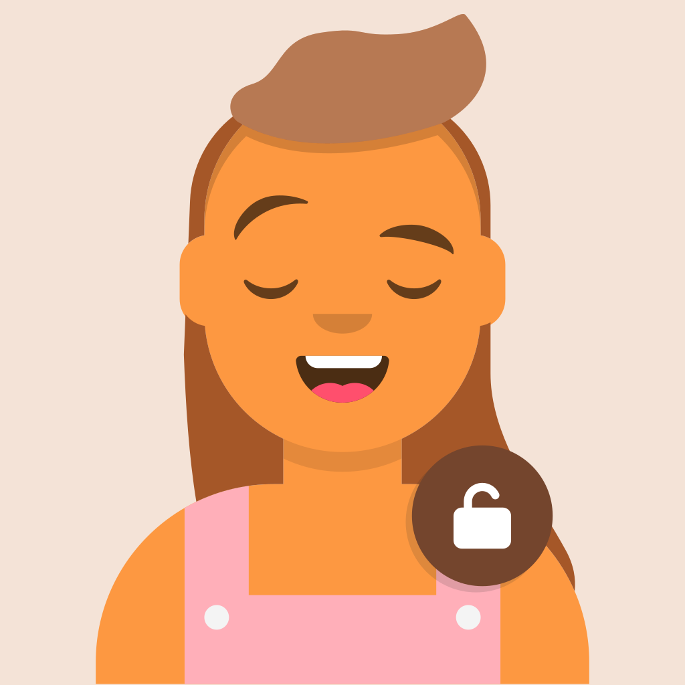
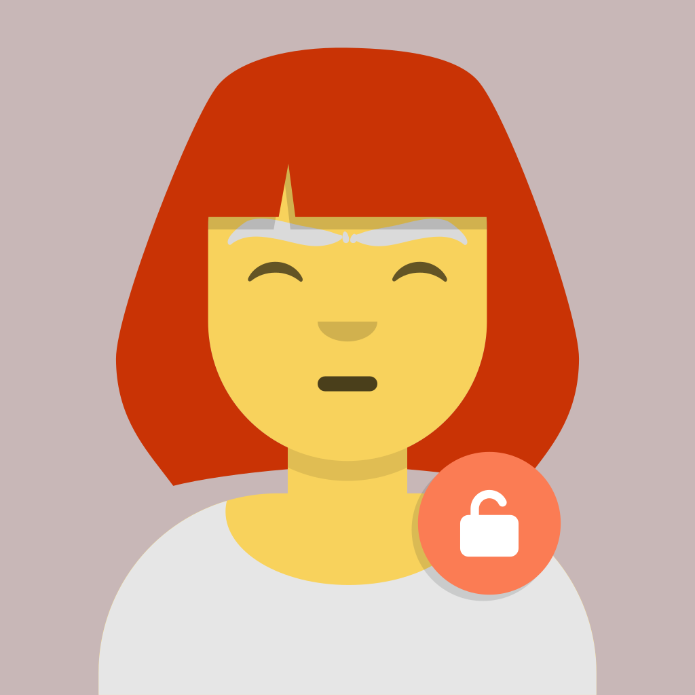

# Resources

🖼️ Arquivos estáticos do projeto Open News Brasil

## Assets

| SVG | PNG | Preview |
|-|-|-|
| [profile.svg](./assets/svg/profile.svg) | [profile.png](./assets/png/profile.png) |  |
| [banner-horizontal.svg](./assets/svg/banner-horizontal.svg) | [banner-horizontal.png](./assets/png/banner-horizontal.png) |  |
| [bot-caco-profile.svg](./assets/svg/bot-caco-profile.svg) | [bot-caco-profile.png](./assets/png/bot-caco-profile.png) |  |
| [bot-gloria-profile.svg](./assets/svg/bot-gloria-profile.svg) | [bot-gloria-profile.png](./assets/png/bot-gloria-profile.png) |  |
| [bot-rachel-profile.svg](./assets/svg/bot-rachel-profile.svg) | [bot-rachel-profile.png](./assets/png/bot-rachel-profile.png) |  |

## Utils

| Tipo | Arquivo | Preview |
|-|-|-|
| Ícone | [newspaper-solid.svg](./utils/icons/newspaper-solid.svg) |  |
| Ícone | [unlock-solid.svg](./utils/icons/unlock-solid.svg) |  |
